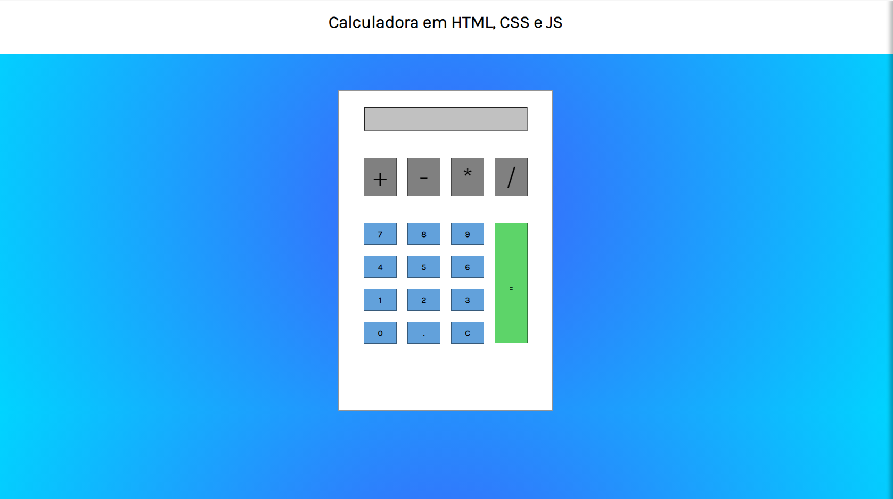

<link href="style.css" rel="stylesheet">
<link href="https://cdn.jsdelivr.net/npm/bootstrap@5.3.0-alpha1/dist/css/bootstrap.min.css" rel="stylesheet" integrity="sha384-GLhlTQ8iRABdZLl6O3oVMWSktQOp6b7In1Zl3/Jr59b6EGGoI1aFkw7cmDA6j6gD" crossorigin="anonymous">

Me chamo Leonardo e sou graduando da Unifesp em nutrição (e futuro fatecano, assim que terminar a primeira graduação),
dentre muitos motivos estou tentando minha primeira vaga não na nutrição, mas como Desenvolvedor Júnior!

Nessa curta jornada percebi que gosto muito de resolver problemas por mais que me estresse de vez em quando com eles.

     

# Projetos

Boa parte dos projetos que estou trabalhando estão no GitHub! Atualmente estou construíndo:

- Uma calculadora, usando HTML, JS e CSS
- Um teclado virtual
- Um gerador de números da Lotofácil (gosto de loteria e ainda mais da lotofácil, pra fugir do simples da Mega-Sena,
  decidi fazer a Lotofácil)
- Uma página inicial com login

Alguns dos que eu mais gostei estão listados abaixo

     

          

               
          

          

                
          

          

        <button class="carousel-control-prev" type="button" data-bs-target="#carouselExample" data-bs-slide="prev">
          
          Previous
        </button>
        <button class="carousel-control-next" type="button" data-bs-target="#carouselExample" data-bs-slide="next">
          
          Next
        </button>

Caso tenha gostado e queira dar uma olhada nos códigos! Só entrar no meu GitHub. Aproveita e segue lá!

 

# Cursos

Utilizo bastante da plataforma da Alura e da DIO. No momento estou cursando o bootcamp Java com 114 horas mas para além disso, alguns cursos que completei estão disponíveis nesse link!

 
 
 
 

