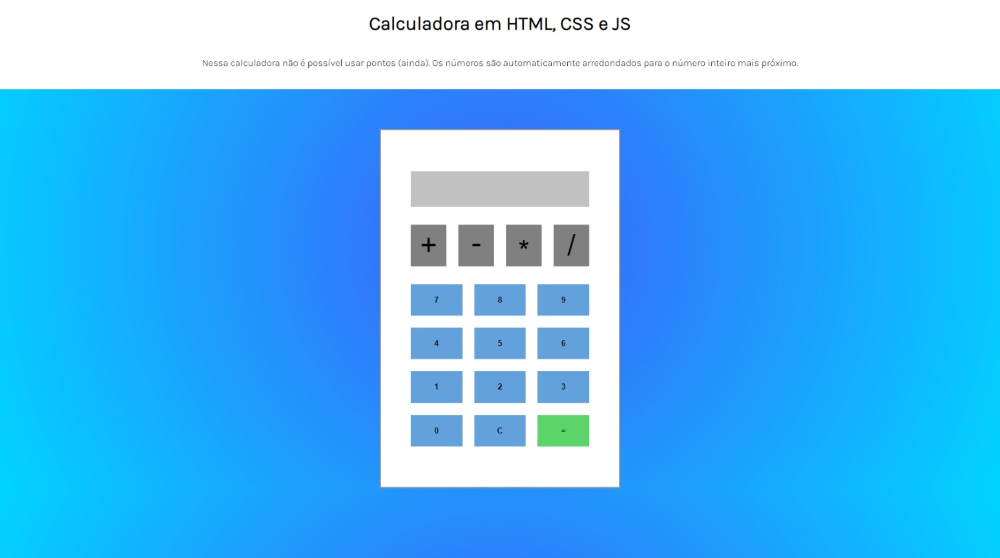

<link href="style.css" rel="stylesheet">
<link href="https://cdn.jsdelivr.net/npm/bootstrap@5.3.0-alpha1/dist/css/bootstrap.min.css" rel="stylesheet" integrity="sha384-GLhlTQ8iRABdZLl6O3oVMWSktQOp6b7In1Zl3/Jr59b6EGGoI1aFkw7cmDA6j6gD" crossorigin="anonymous">

Me chamo Leonardo e sou graduando da FATEC em Sistemas para Internet, além disso sou formado em Nutrição!
dentre muitos motivos estou tentando minha primeira vaga não na nutrição, mas como Desenvolvedor Júnior!

     

# Projetos

Boa parte dos projetos que estou trabalhando estão no GitHub! Atualmente estou construíndo:

- Um gerador de senhas
- O Wordle, que talvez seja o meu melhor projeto até agora!
- Um web app com React para uma cafeteria
- Um teclado virtual

Alguns dos que eu mais gostei estão listados abaixo

     

        

                 
        

        

                 
          

          

                
          

          

                 
          

          

                 
          

        <button class="carousel-control-prev" type="button" data-bs-target="#carouselExample" data-bs-slide="prev">
          
          Previous
        </button>
        <button class="carousel-control-next" type="button" data-bs-target="#carouselExample" data-bs-slide="next">
          
          Next
        </button>

Caso tenha gostado e queira dar uma olhada nos códigos! Só entrar no meu GitHub. Aproveita e segue lá!

 

# Cursos

Utilizo bastante da plataforma da Alura da DIO e do Front End Master. No momento estou cursando a trilha de JS e TS, para além disso, alguns cursos que completei estão disponíveis nesse link!

 
 
 
 

